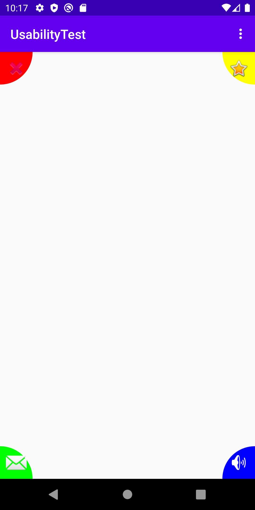

# Corner Gestures

The corner gestures can be used to enable interaciotn with the corners of a UI element. The `CornerGestureOnTouchListener`
is an `View.OnTouchListener`, that calculates if a swipe happened towards the corners. For this the distance of activation
is calculated by using a modifiable percentage of the shorter side of the view it is attached to. It then notifies the
caller if the user is hovering over one of the corners or if he / she has swiped to one of the corners and released the 
touch.

 ## How to use
 
 The `CornerGesturesOnTouchListener` expects the percentage to use as a double (has to be <= 0.5) and a `CornerGesturesListener`
 that is used as a Callback. This callback will be called with the corner that is currently being hovered over or has been
 swiped towards. To attach the `CornerGesturesOnTouchListener` to a view simply call
 
 ```kotlin
view.onTouchListener = CornerGesturesOnTouchListener(percentag, cornerGestureListener)
```

If you want to use the provided `CornerGestureLayout`, which puts simple quarter circles into the
corners of the surrounded view, surround your view within the `CornerGestureLayout`:

```xml
    <at.naske.microdo.lib.cornergestures.CornerGesturesLayout
            android:id="@+id/tagging_frame"
            android:layout_width="wrap_content"
            android:layout_height="wrap_content"
            android:layout_gravity="center">
            ... your content
    </at.naske.microdo.lib.cornergestures.CornerGesturesLayout>
```


Example of the CornerGestureLayout, having icons and colors set to the corners

The `CornerGestureHelper` can be used to set icons for the corner gestures, as well as define the 
color and the visibility at the moment:

```kotlin
// Corner gesture helper looks for the ids of the corner buttons itself within the given view
mCornerGestureHelper = CornerGestureHelper(view)
mCornerGestureHelper.setVisibilityOfAll(VISIBLE)
mCornerGestureHelper.setBottomLeftCorner(color = Color.YELLOW, icon = android.R.drawable.star_big_on)
mCornerGestureHelper.setBottomRightCorner(color = Color.RED, icon = android.R.drawable.ic_delete)
mCornerGestureHelper.setTopRightCorner(color = Color.GREEN, icon = android.R.drawable.ic_lock_silent_mode_off)
mCornerGestureHelper.setTopLeftCorner(color = Color.BLUE, icon = android.R.drawable.presence_busy)
```
