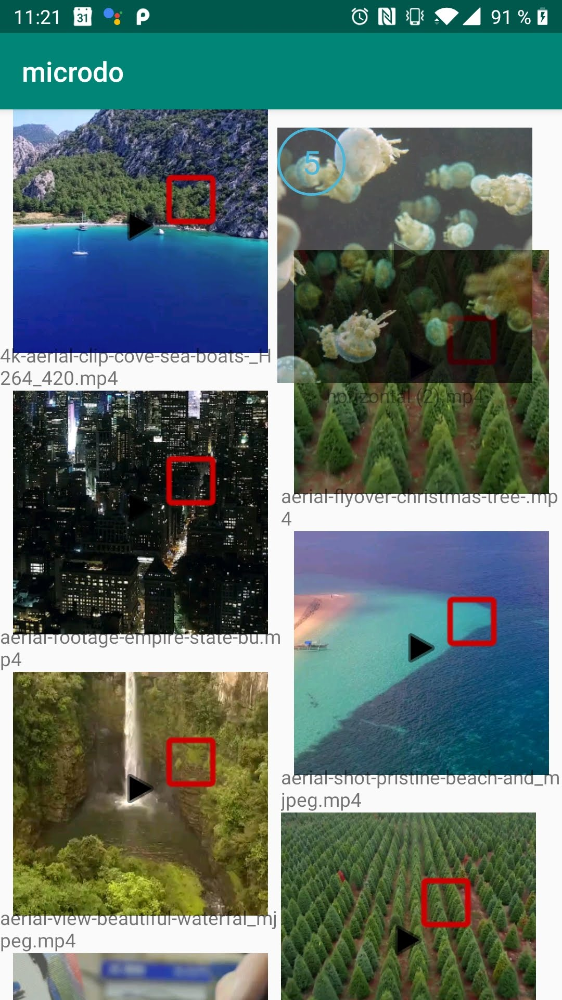

# Multimove

## How to use

To move multiple items within a `RecyclerView`, you need to initialize a `MultiMoveDragInitializer`
that requires a list of items to move, and a fitting `MutableRecyclerViewAdapter` that can be used
to first remove the items from and add the items in case the move operation gets canclled or ends
outside of a listener that accepts it.

```kotlin
val itemsToMove = ArrayList<Item>()
val dragInitializer = MutliMoveDragInitializer(adapter, itemsToMove)
view.setOnLongClickListener(MutliMoveOnLongClickListener(dragInitializer))
```

In this example the `MultiMoveDragInitializer` is used in the provided `MutliMoveOnLongClickListener`,
which start the drag and drop behaviour as soon as an item is long clicked.

This will remove all items using the adapter and start drag on drop on the long clicked view. This
hides the checkbox from the provided Swipeselect framework if it exists and shows the number of moving
items on the moved view, if it is wrapped within the MultiMoveContainer.

## MultimoveLayout

The `MultimoveLayout` is a layout specified to show the number of contained items. It shows the number
on top of the contained view - in the top left corner by default. To wrap your view within the 
multimove container you can use the `MultiMoveLayout` within your layout xml.
This layout is a simple `FrameLayout` that adds the the count of included items:

```xml
<at.naske.microdo.lib.multimove.MultimoveLayout
    xmlns:android="http://schemas.android.com/apk/res/android"
    xmlns:app="http://schemas.android.com/apk/res-auto"
    android:layout_width="wrap_content"
    android:layout_height="wrap_content">

    ... add your content

</ at.naske.microdo.lib.multimove.MultimoveLayout>
```

You can use the `MultiMoveHelper` to update the number of elements shown on the layout.

```kotlin
MultiMoveHelper.showContainedObjectCount(view, items.size)
```


Example of the Multimove container, showing that 5 elements are currently being dragged on the top right