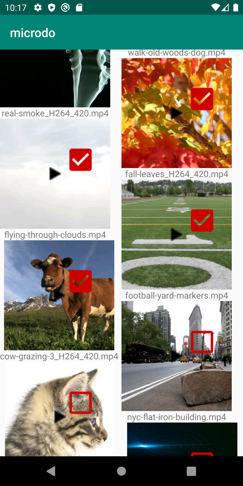

# Swipeselect

The Swipeselect components allow you to select multiple items within a list, or actually within any
component. 

## How to use

Simply attach a `SwipeSelectListener` either as `OnClickListener` if the also clicks should be possible,
or as `OnTouchListener` to catch the concrete swipe. In most cases the `OnTouchListener` usage will
be enough, but if the children also have an `OnLongClickListener` attached, a simply click won't be 
recognized as swipe.

For the `SwipeSelectListener` it is required to give a `SwipeSelectCallback`. This callback is used
to identify the items swiped over as well as notify about items having been selected and if the 
swipe ended.

```kotlin
    mSwipeSelectListener = SwipeSelecListener(this)
    recyclerView.setOnTouchListener(swipeSelectListener)
    
    ...

    override fun swipeEnded(selectedItems: Collection<Item>) {
        // do something with the items when the swipe ended
    }

    override fun select(item: Item) {
        // e.g. toggle the checkbox using the SwipeSelectHelper
        mRecyclerView.findViewHolderForAdapterPosition(mItems.indexOf(item))?.itemView?.let {
            SwipeselectHelper.toggleCheckBox(it)
        }
    }
```

There also exists the `SwipeselectLayout` which is a simple FrameLayout that also includes a checkbox
which can be toggled to show that an item has been selected or not. For this simply use it as the 
root element of your item view. The check mark will appear on the top right and has the item id
`swipeselect_checkbox` if any changes to this element should be made.

```xml
<at.naske.microdo.lib.swipeselect.SwipeselectLayout
    xmlns:android="http://schemas.android.com/apk/res/android"
    android:layout_width="wrap_content"
    android:layout_height="wrap_content"
    xmlns:app="http://schemas.android.com/apk/res-auto">
    
    ... your child views

</at.naske.microdo.lib.swipeselect.SwipeSelectLayout>
``` 


Example of the Swipeselect Container, shwoing the check boxes on the list items