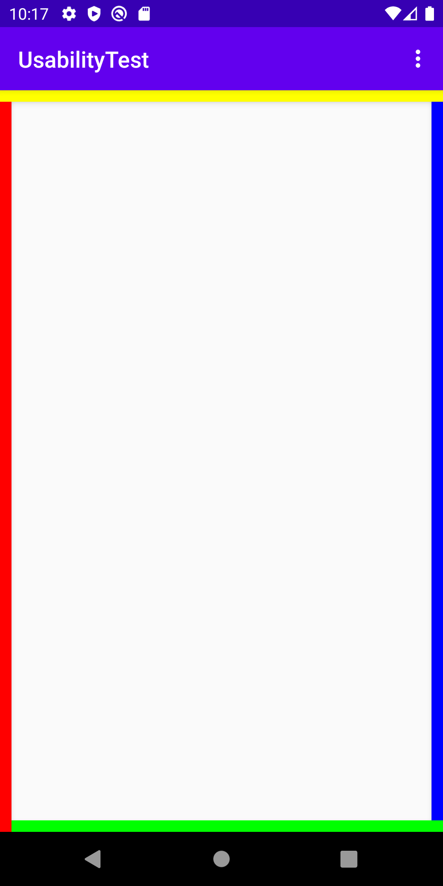

# Tagging

## What is a tag

A tag is some kind of meta information that can be stored as a String. This way files can be enhanced with more information
than normal files systems store. In particular the implementation done for the MicroDO library makes use of the ``JCodec``
library to tag MP4 files in particular.

## How to tag a file
To tag a file, create a `VideoTaggingService` using 

```kotlin
val taggingService = VideoTaggingService(file)
```

With this tagging service you can simply create tags and add them to the file, or read specific tags from the managed file.

```kotlin
val tag = Tag("key", "value")
taggingService.tagFile(tag)

val tagValue = taggingService.getTag("key")
``` 

In addition when creating the `VideoTaggingService` a prefix and prefix delimiter can be defined. This can be used
to make tags identifiable when moving them in between devices and applications. No prefix is added by default, and the 
default delimiter is set to `.`

```kotlin
val taggingService = VideoTaggingService(file, "at-naske-microdo", "-")
```

This will append `at-naske-microdo` to any key added to or read from the managed file and use `-` as delimiter if it is
not already appended.

## How to use the SideTagsLayout

A simply visualization possibility has been provided called SideTags. This allows to create a frame
around your view, where each side is colored differently and can be turned on / off based on a tag.

To encapsulate your view into the TaggingLayout simply add the following to your xml:
```xml
<at.naske.microdo.lib.tagging.SideTagsLayout android:layout_width="wrap_content"
                                           android:layout_height="wrap_content"
                                           android:id="@+id/demo_constraint_wrapper">
                ... your content
</at.naske.microdo.lib.tagging.SideTagsLayout>
```

Example of the Tagging Frame


Then you can use the `TaggingHelper` to modify this layout.

```kotlin
// Create tagging helper object around the view that has the the tagging layout somewhere inside
val mTaggingHelper = TaggingHelper(view)
// Toggle the tags in different ways
mTaggingHelper.toggleBottomTag(View.VISIBLE, Color.RED)
mTaggingHelper.toggleTopTag(color = Color.GREEN)
mTaggingHelper.toggleRightTag(View.GONE)
mTaggingHelper.toggleLeftTag(null, Color.YELLOW)
```


